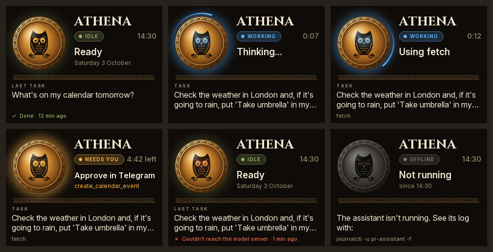

# pi-assistant

A personal AI assistant that runs on your own hardware. A Raspberry Pi hosts the assistant (Telegram bot, agent loop, tools and long-term memory) and calls a local model on a Mac through an OpenAI-compatible API such as [oMLX](https://omlx.ai).

```
 Telegram app                 Raspberry Pi (always on)                         Mac (headless)
 ────────────      ┌──────────────────────────────────────────┐      ┌─────────────────────────────┐
  you  ◄────────►  │ pi-assistant (this repo)                 │      │ oMLX                        │
       long poll   │   Telegram bot ─► agent loop ────────────┼─────►│   Gemma 4 26B A4B (4-bit)   │
                   │                   │  tool calls          │ HTTP │   OpenAI-compatible /v1     │
                   │   memory ◄────────┤                      │      │                             │
                   │   (SQLite + vec)  │  MCP client ─────────┼─────►│ MCP servers: your files     │
                   │                   │      │               │ SSH  │   (read-only), Calendar and │
                   │ Ollama: embeddinggemma   ▼               │      │   Reminders (iMCP)          │
                   │ MCP servers: time, fetch, email, SEC ... │      └─────────────────────────────┘
                   └──────────────────────────────────────────┘
```

## What it does

- **Chat over Telegram**: long polling, so the Pi needs no open ports. Only Telegram user IDs you list can use it.
- **Ask by voice**: say "Hey Siri, Ask Athena" on your iPhone or Mac. Siri reads the answer out, and your question and the answer also appear in the Telegram chat.
- **Tool calling with MCP**: connects to any MCP server, on the Pi, on your Mac over SSH, or remote over HTTP. Per-server filters choose which tools the model sees.
- **A general assistant**: [recommended servers](#mcp-servers) let it search and read files on your Mac, use your Calendar and Reminders, read the news, look up company filings and GitHub repos, and handle an email address of its own. Built-in tools read your [Trading 212](#trading-212) account and place the trades you approve, and query [SQLite databases](#databases) you choose.
- **Approval before actions**: MCP tools show *Allow / Deny* buttons in Telegram, with their full arguments, before they run. Use `confirm` to choose which tools ask; by default they all do.
- **Long-term memory**: the model saves facts with `remember` and looks them up with `search_memory`. Related memories are also added to each message automatically. Embeddings come from EmbeddingGemma on the Pi through Ollama, and are stored in SQLite with [sqlite-vec](https://github.com/asg017/sqlite-vec).
- **Your notes as memory**: `pi-assistant ingest ~/notes` indexes Markdown and text files so the assistant can search them.
- **Fast replies with prompt caching**: the system prompt, tools and earlier messages stay identical between requests, and old history is trimmed in batches. That lets oMLX reuse its cached prompt, which matters a lot on Apple Silicon. The assistant also keeps that cache warm, so your messages rarely wait for it, and `doctor` measures how long your Mac takes to read the prompt.
- **A status board**: with a Pimoroni Display HAT Mini, the Pi's screen shows what the assistant is doing: idle, working on your request, or waiting for your approval.
- **SSH-friendly tools**: `pi-assistant doctor` checks every connection, `pi-assistant chat` gives you a terminal chat, and `pi-assistant eval` compares models on tool calling.

## Install on the Pi

You need a Raspberry Pi 4/5 running 64-bit Raspberry Pi OS (Bookworm or later), a model served by oMLX (or any OpenAI-compatible server) that the Pi can reach, and a Telegram bot token from [@BotFather](https://t.me/BotFather) (`/newbot`).

Over SSH:

```bash
git clone <your-repo-url> ~/pi-assistant
cd ~/pi-assistant
bash scripts/install.sh
```

The script installs uv and Ollama, pulls `embeddinggemma`, installs the Python dependencies, turns off `git push` for this clone, creates `config.toml` and `.env`, and registers a systemd service. It doesn't start the service. It's safe to re-run. If you have a Display HAT Mini, run it with `--display` to set up the [status board](#status-board) too.

Then:

1. **Secrets:** run `nano .env` and set `TELEGRAM_BOT_TOKEN`, plus `LLM_API_KEY` if your oMLX server uses one.
2. **Settings:** run `nano config.toml`. At minimum set:
   - `llm.base_url`: your Mac, for example `http://my-mac.local:8000/v1` or its Tailscale name.
   - `llm.model`: the model id exactly as oMLX lists it. The next step prints the ids if you're unsure.
   - `agent.user_name` and `agent.timezone`.
3. **Check:** run `uv run pi-assistant doctor`. Fix anything marked ✗.
4. **Try it in the terminal:** run `uv run pi-assistant chat`.
5. **Start the bot:** run `sudo systemctl start pi-assistant`, and follow its logs with `journalctl -u pi-assistant -f`.
6. **Lock it down:** message your bot. Because no users are allowed yet, it replies with your Telegram user ID. Put that ID in `telegram.allowed_user_ids` and run `sudo systemctl restart pi-assistant`.

> oMLX must accept connections from the Pi, not just from `localhost`, and should have an API key set. `doctor` tells you if the Pi can't reach it.

## Using it

**Telegram**: send any message. Commands:

| Command | What it does |
|---|---|
| `/reset` | Start a fresh conversation. Long-term memories are kept. |
| `/remember <fact>` | Save a fact directly. |
| `/recall [query]` | Search memories, with similarity scores. With no query it shows the most recent. |
| `/forget <id>` | Delete a memory. |
| `/tools` | List tools and the status of each MCP server. |
| `/reload` | Reconnect to MCP servers, for example after the Mac restarts. |
| `/status` | Model server, memory and tool health. |

**Command line** (run from the repo with `uv run pi-assistant <command>`):

| Command | What it does |
|---|---|
| `run` | Run the Telegram bot. This is what the systemd service runs. |
| `chat` | Chat in the terminal, with the same tools and memory. |
| `doctor` | Check the model server, embeddings, database, MCP servers and Telegram. |
| `ingest PATH...` | Add `.md`/`.txt` files or folders to memory. Re-running a file replaces its old chunks. |
| `reindex` | Re-embed everything after changing the embeddings model. |
| `eval -m MODEL [-m MODEL2]` | Compare models on tool calling (see below). |
| `display` | Run the [status board](#status-board). `--demo` cycles through example states; `--preview FILE` draws to an image instead of the screen. |

## Status board

With a [Pimoroni Display HAT Mini](https://pinout.xyz/pinout/display_hat_mini) on the Pi, the screen shows what the assistant is doing:



- **Idle:** the time, and how your last request went.
- **Working:** your request, what the assistant is doing now (thinking, or which tool it's using), the tools it has used and how long it's taken. A light runs round the shield.
- **Needs you:** a tool is waiting for your approval in Telegram. The shield pulses amber, the LED flashes and the clock counts down to when the request is denied automatically.
- **Offline:** the assistant isn't running.

Press any button to turn the screen off. It comes back on by itself whenever the assistant is working or needs you. In `config.toml`, `[display]` can keep your messages off the screen (`show_task = false`) or turn off the LED.

To set it up, run `bash scripts/install.sh --display`. That turns on SPI, installs the drivers and starts the `pi-assistant-display` service, which shows "offline" until the assistant starts. To test the screen on its own, stop the service and run `uv run pi-assistant display --demo`. On any computer, `uv run pi-assistant display --preview board.png` draws the board into an image instead.

The board runs as a separate service, so it keeps working, and says so, when the assistant isn't running. The assistant writes its status to `data/status.json` as it works, and holds a lock on `data/status.lock` while it runs. The system releases that lock even if the assistant crashes, which is how the board knows it's offline.

## Siri

Say **"Hey Siri, Ask Athena"** on your iPhone or Mac, then ask your question. Siri reads the answer out. Your question and the answer also go to the Telegram chat, so you can follow up there.

An Apple Shortcut sends what you said to the Pi over [Tailscale](https://tailscale.com), with a token. Athena answers just as if you'd typed it in Telegram, with the same memory, tools and approvals.

- **Approvals still happen in Telegram.** If a tool needs your OK, Siri tells you to look there.
- **Siri waits about 25 seconds at most.** If the answer takes longer, Siri says it'll be in Telegram, where it arrives when it's ready.
- **In Telegram, the bot posts your question** as "🎙️ You, via Siri", because a bot can't post messages as you.
- **Say the shortcut's name first, then your question.** Siri doesn't take the question in the same breath for a shortcut you made yourself.

Your iPhone and Mac need Tailscale, on the same tailnet as the Pi.

### Set it up

1. **On the Pi**, make a token and add it to `.env`:

   ```bash
   cd ~/pi-assistant
   echo "SIRI_TOKEN=$(openssl rand -hex 24)" >> .env
   grep SIRI_TOKEN .env   # you'll need it for the shortcut
   ```

   In `config.toml`, set `enabled = true` under `[siri]`. Then:

   ```bash
   sudo tailscale serve --bg --http=80 localhost:8090
   sudo systemctl restart pi-assistant
   uv run pi-assistant doctor   # the Siri section should say "listening"
   tailscale status --json | python3 -c 'import json,sys; print(json.load(sys.stdin)["Self"]["DNSName"].rstrip("."))'
   ```

   The last command prints the Pi's name on your tailnet, such as `pi.tail1234.ts.net`. Athena's endpoint only listens on the Pi itself, and Tailscale Serve passes requests to it from devices on your tailnet, and from nowhere else. Plain HTTP is fine, because Tailscale encrypts the connection. `--bg` keeps it on after restarts; `sudo tailscale serve reset` turns it off.

2. **In the Shortcuts app** on your iPhone or Mac (iCloud syncs it to the other), make a shortcut called **Ask Athena** with three actions:

   1. **Ask for Input**: type *Text*, prompt *What do you want to ask?* When Siri runs the shortcut, you answer by voice.
   2. **Get Contents of URL**: `http://<the Pi's tailnet name>/ask`. Under *Show More*, set *Method* to *POST*. Add a header named `Authorization` with the value `Bearer <your SIRI_TOKEN>`. Set *Request Body* to *JSON* and add a *Text* field named `prompt`, set to *Provided Input*.
   3. **Show Result**, showing *Contents of URL*. Siri reads it out.

3. **Try it:** "Hey Siri, Ask Athena". To test from a Mac's terminal instead:

   ```bash
   curl -H "Authorization: Bearer <your SIRI_TOKEN>" -H "Content-Type: application/json" \
     -d '{"prompt": "What time is it?"}' http://<the Pi's tailnet name>/ask
   ```

The token is stored in the shortcut, which iCloud syncs between your devices. Take it out before sharing the shortcut with anyone. To change it, update `.env` and the shortcut, then restart the service.

## MCP servers

Servers are listed under `[mcp_servers.<name>]` in `config.toml`. Each has either `command` (a local server spoken to over stdio) or `url` (a remote server over Streamable HTTP; URLs ending in `/sse` use the older SSE transport). Optional settings:

- `include`, `exclude` and `confirm` take glob patterns matched against the server's tool names.
- `confirm` lists the tools that ask for your approval before they run. It defaults to `["*"]`, every tool, because any tool might send your data off your network. If you narrow it to some tools, use `include` too, so tools you haven't checked can't run without asking.
- `headers` adds HTTP headers, such as an auth token.
- `env` passes extra environment variables to a local server. Local servers otherwise get only a minimal environment, so your Telegram token isn't exposed to them.
- `enabled = false` keeps a server's settings without starting it.

After changing servers, restart the service (`sudo systemctl restart pi-assistant`) and check them with `uv run pi-assistant doctor`. Each local server's stderr is written to `data/logs/mcp-<name>.log`. If a server on the Mac stops answering, for example after the Mac restarts, send `/reload`.

### Recommended servers

`config.example.toml` has each of these ready to copy into your `config.toml`, switched off until you set it up. To add others, see [Adding a server](#adding-a-server).

| For | Server | Runs on | Asks first |
|---|---|---|---|
| The time | `mcp-server-time` | Pi | Never |
| Web pages | `mcp-server-fetch` | Pi | Every fetch |
| Web search | [DuckDuckGo](https://github.com/nickclyde/duckduckgo-mcp-server) | Pi | Every search |
| [Files on your Mac](#your-mac-files-calendar-and-reminders) | `mac_files`, in this repo: read-only | Mac, over SSH | Never |
| [Calendar and Reminders](#your-mac-files-calendar-and-reminders) | [iMCP](https://github.com/mattt/iMCP) | Mac, over SSH | Adding events and reminders |
| [News](#news) | `read_news`, built in | Pi | Never |
| [Trading 212](#trading-212) | `trading212_*`, built in | Pi | Placing and cancelling orders |
| [Databases](#databases) | `database_*`, built in: read-only SQLite | Pi | Never |
| [Company filings](#company-filings) | [EdgarTools](https://github.com/dgunning/edgartools) | Pi | Never |
| [GitHub](#github) | [GitHub's own server](https://github.com/github/github-mcp-server): read-only | GitHub | Never |
| [Email](#email) | [mcp-email-server](https://github.com/Wh1isper/mcp-email-server) | Pi | Sending |

What asks first follows one rule: a tool asks if it can change something, or can send what's in the conversation somewhere someone else could read it. Reading your own files, calendar and databases keeps everything on your network, and reading your Trading 212 account only asks Trading 212 for what it already holds. Looking things up in public sources (your news feeds, the SEC, GitHub's public repos) sends only the lookup itself, to that service. Fetching a URL, searching the web and sending email can reach anyone, and adding a calendar event can email an alarm to any address, so those ask. To make any server ask first, set `confirm = ["*"]` on it.

Versions are pinned, as in `mcp-email-server==1.11.0`, so a new release can't change what runs on your Pi until you choose to update.

Tools only run when the model uses them, but every tool's description is part of every prompt, so the model knows what it can use. With everything above switched on, the descriptions come to about 10,000 tokens, against about 1,300 for the system prompt and the first three servers. Email, SEC filings and GitHub account for two-thirds of that, while Trading 212's five tools add about 650 and the database tools about 200.

On most messages that costs almost nothing, because oMLX caches the part of the prompt it has already read, and the assistant keeps the cache warm: at startup, after `/reload`, and every 10 minutes (`llm.warm_up_minutes`). But when the cache is cold, for example just after the Mac restarts, the next message waits while the Mac reads the whole prompt again. On an M1 Pro that could be a minute with every server on. To see what yours costs, run `doctor`: its last section measures how many tokens the tools add, how long your Mac takes to read them, and whether oMLX's cache is working. If it's slow, switch off servers you rarely use, or narrow their `include` lists.

### Your Mac: files, Calendar and Reminders

Two servers run on your Mac: `mac_files` from this repo, which can search folders you choose with Spotlight and read text, PDF, Word, RTF and HTML files in them, and [iMCP](https://github.com/mattt/iMCP), for Calendar and Reminders. The Pi connects to them over SSH, with a key that can only reach those two servers: no shell, no port forwarding, nothing else. On the Mac, launchd starts a server for each connection inside your login session, so macOS asks for access to your folders and calendars as it would for any app.

`mac_files` can't change, move or delete anything. It can't see outside the folders you choose, even through a symlink, or hidden files and folders inside them, such as `.env` or `.git`.

1. **On the Pi**, make the key and the `athena-mac` SSH entry, using the Mac's name on your tailnet and your user name on the Mac:

   ```bash
   bash scripts/connect-mac.sh my-mac.tail1234.ts.net georges
   ```

   It prints the command for step 3, with the Pi's public key in it.
2. **On the Mac**, clone this repo, install iMCP with `brew install --cask mattt/tap/iMCP`, and turn on Remote Login: System Settings > General > Sharing > Remote Login, allowing only your user.
3. **On the Mac**, in the repo, run the command step 1 printed, with the folders the assistant may read. For iCloud Drive, add `--folder "$HOME/Library/Mobile Documents/com~apple~CloudDocs"`:

   ```bash
   bash scripts/mac/install.sh --pi-key "ssh-ed25519 AAAA... athena@pi" --folder ~/Documents
   ```

4. **On the Mac**, open iMCP. Turn on Calendar and Reminders only, allow access when macOS asks, and turn on "Start at login" in its settings.
5. **On the Pi**, run `ssh athena-mac hello`. It should say there's no server called 'hello', which means the key works. Then set `enabled = true` on `files` and `apple` in `config.toml`, restart the service and run `doctor`.
6. **On the Mac**, the first time the Pi uses each server, macOS asks for access to your folders (for "python3") and to the local network (for "imcp-server"). Allow them, over Screen Sharing if the Mac has no screen.

The Mac needs to stay on and logged in. After updating the repo on the Mac, run `scripts/mac/install.sh` again, without options to keep the same folders. `bash scripts/mac/install.sh --uninstall` removes it all, including the Pi's key.

### News

`read_news` reads the news feeds (RSS or Atom) listed under `[news.feeds]` in `config.toml`, and only those. All the model chooses is which feed to read and how many items, so it can't be used to send anything anywhere, and doesn't ask first. Most news sites have a feed: add their address with any name you like. To read a whole article, the model uses `fetch`, which asks first.

### Trading 212

`trading212_portfolio`, `trading212_history` and `trading212_find_instrument` read your Trading 212 account: its value and cash, each holding with its profit or loss, pending orders, and past orders, dividends, deposits and withdrawals. They don't ask first. They only fetch your own account from Trading 212, and the instrument search runs on a list the Pi keeps, so what you search for isn't sent anywhere.

`trading212_place_order` and `trading212_cancel_order` always ask first, and can't be set not to. The approval message says in words what Trading 212 calls the instrument and where it trades, the price terms, which account, how many you hold and, when it can, roughly what the order comes to, above the exact request. That way you'll notice if the model picked the wrong listing, such as Apple in euros instead of dollars. An order Trading 212 would refuse, such as selling shares you don't have, is stopped before you're asked. An approved order is sent once and never retried, because Trading 212 would place a repeated order twice. If its answer gets lost, Athena is told the order may or may not have gone through, and to check before trying again.

To set it up:

1. In the Trading 212 app, go to **Settings > API (Beta)** and generate a key. The API works with Invest and Stocks ISA accounts.
2. Choose its permissions: account data, portfolio, history, metadata and reading orders. To trade, also allow executing orders. Leave pies off: Athena doesn't use them.
3. Restrict it to trusted IPs, and give your home's public address, which `curl -s https://api.ipify.org` on the Pi prints. Then the key is useless anywhere else. If your provider changes your address, the key stops working until you update it, and `doctor` will tell you.
4. Put the key and its secret in `.env` as `TRADING212_API_KEY` and `TRADING212_API_SECRET`, set `enabled = true` under `[trading212]` in `config.toml`, restart and run `doctor`. It checks the key and lists any permissions it's missing.

Orders are for a number of shares, which can be a fraction: Trading 212's API doesn't take orders by amount. Limit and stop prices are in the instrument's own currency, which is pence (GBX) for most London shares. The API only gives prices for what you hold, so for anything else ask Athena to look the price up first. To practise, make a key in Trading 212's practice mode and set `environment = "demo"`.

### Databases

`database_tables` and `database_query` read the SQLite databases listed under `[sqlite.databases]` in `config.toml`, by the names you give them, and no other files. The files must be on the Pi. A path can be absolute, or relative to the config's folder.

They can only read, and SQLite itself enforces that. Each file is opened read-only, and an authorizer refuses everything but reading before a statement runs. Both are needed: a read-only connection alone would still let `VACUUM INTO` copy the database anywhere, and `ATTACH` create files. Statements that don't start with SELECT, WITH or VALUES aren't tried at all, a query is stopped after 10 seconds, and at most 100 rows come back. So they don't ask first, and they're safe to use on a database another program is writing to.

### Company filings

[EdgarTools](https://github.com/dgunning/edgartools) searches and reads filings to the US Securities and Exchange Commission: annual and quarterly reports, financial statements, insider trades and fund holdings. The SEC asks callers to say who they are, so set `EDGAR_IDENTITY` in `.env` to your name and email, like `Jane Doe jane@example.com`.

It needs about 300 MB of Python packages, mostly data libraries, which take longer to install on a Pi than the assistant waits for a server to start. So install them before switching it on:

```bash
uvx --from "edgartools[ai]==5.60.0" edgartools-mcp --help
```

### GitHub

This uses the server GitHub hosts, in read-only mode with lockdown on. Lockdown hides text in issues and pull requests from people without push access to the repo, which is where instructions aimed at an assistant would most likely be hidden.

Make a [fine-grained token](https://github.com/settings/personal-access-tokens/new) with **Public repositories (read-only)** access and an expiry date, and set it as `GITHUB_TOKEN` in `.env`. It can't see your private repositories or change anything, even if someone got hold of it.

### Email

Give the assistant an email address of its own, with any provider that offers IMAP, SMTP and app passwords, such as Fastmail, iCloud Mail or Gmail with 2-Step Verification. Then it can't read your own mail, and its password only opens its own mailbox. Forward it anything you'd like it to read.

Put the app password in `.env` as `EMAIL_PASSWORD`, and the address and your provider's IMAP and SMTP servers in the `email` block. Two settings in that block are enforced by the email server itself, whatever the model asks for and whatever you approve:

- `MCP_EMAIL_SERVER_ALLOWED_RECIPIENTS`: who it may email, comma-separated, with `*` as a wildcard. Start with just your own address.
- `MCP_EMAIL_SERVER_ALLOWED_MUTATIONS = "send"`: it can send, but never delete, move, flag or draft.

Sending always asks first. Check the recipients, and the `attachments` list: it can attach any file the Pi can read. To have it only see mail from you, also set `MCP_EMAIL_SERVER_ALLOWED_SENDERS` to your own addresses.

### Adding a server

To give the assistant a new ability, look for an MCP server that provides it. Most are listed in the [MCP Registry](https://registry.modelcontextprotocol.io), and the assistant can search it for you: ask it to fetch `https://registry.modelcontextprotocol.io/v0/servers?search=<topic>`.

1. **Choose carefully.** A server sees whatever the assistant passes it and can act on your behalf. Prefer one from the service's own makers, or one that's widely used and recently updated, and read what each of its tools does.
2. **Give it as little as possible.** Use its read-only mode if it has one, and give it a token or account that can only do what you need. Use any limits the server itself enforces, like the email server's allowed recipients.
3. **Add it to `config.toml`:**

   ```toml
   [mcp_servers.weather]
   command = "uvx"                                   # a Python server from PyPI
   args = ["some-weather-mcp==1.2.3"]                # pinned to a version you've checked
   env = { WEATHER_API_KEY = "${WEATHER_API_KEY}" }  # secrets go in .env
   include = ["get_forecast"]                        # only the tools you need
   confirm = []                                      # see below
   ```

   - **npm servers:** these need Node.js on the Pi (`sudo apt install nodejs npm`). Use `command = "npx"` and `args = ["-y", "some-server@1.2.3"]`.
   - **Hosted servers:** these take `url` and `headers` instead, like the GitHub one.
   - **Servers that need your Mac's apps or files** run on the Mac. Add a line to `SERVERS` at the top of `scripts/mac/install.sh` and run it again on the Mac. Then on the Pi, use `command = "ssh"` and `args = ["athena-mac", "<its name>"]`.
   - **`confirm`:** leave it out, so every tool asks first, unless the tools only read your own data or look things up in public sources. Anything that changes something, or can send to anyone (email, messages, any URL), should ask.
4. **Check it:**
   - Restart the service (`sudo systemctl restart pi-assistant`), then run `uv run pi-assistant doctor`. It lists the server's tools and shows how much they add to every prompt.
   - Send `/tools` in Telegram to see them there too.
   - Run `uv run pi-assistant eval -m <your model>` to check the model still picks the right tools.

To update a server later, read what changed, change its pinned version and restart. If no safe server exists for something, the assistant can have a built-in tool instead, like `read_news` in `src/pi_assistant/news.py`. A built-in tool is a name, a description, a JSON schema for its arguments and a Python function, added in `build_services`. A tool that asks first can also have a `preview` function, which checks the arguments and says in words what the call will do, for the approval message. `trading212_place_order` has one.

## Memory

- **Auto-recall:** before each message, the closest memories (up to `recall_top_k`, within `recall_max_distance`) go into a `<context>` block together with the current time. Use `/recall something` to see similarity scores. If unrelated memories keep appearing, lower `recall_max_distance`. If relevant ones are missed, raise it.
- **Saving:** the model saves durable facts on its own, guided by `prompts/system.md`. `/remember` lets you add them yourself.
- **Embeddings model:** `embeddinggemma` (768 dimensions, about 600 MB of RAM) runs on the Pi's CPU through Ollama. To switch models, change `[embeddings]` and run `pi-assistant reindex`. If you change `dimensions`, start a fresh database instead.
- **Storage:** everything (history and memory) lives in `data/assistant.db`. Back up that one file.

## Choosing a model

`eval` runs nine short tool-calling scenarios against each model and reports pass/fail and speed:

```bash
uv run pi-assistant eval -m gemma-4-26b-a4b-it-4bit -m qwen3.6-35b-a3b-4bit --repeat 3
```

It covers picking the right tool, filling in arguments, answering without tools when none is needed, and a two-step task. It only needs the model server, so you can also run it on the Mac.

On an M1 Pro with 32 GB, mixture-of-experts models with about 3–4B active parameters are the right size: dense 27B+ models generate too slowly for multi-step tool use. Larger models may need a higher GPU memory limit, for example `sudo sysctl iogpu.wired_limit_mb=26624`.

## Updating

```bash
cd ~/pi-assistant && bash scripts/update.sh
```

It pulls the latest code, updates the dependencies (keeping the status board's, if you set it up) and restarts the services.

## Development

```bash
uv sync          # includes the test dependencies
uv run pytest    # offline: fake model server, real sqlite-vec, real MCP servers in subprocesses
```

uv uses its own Python build for this project (`[tool.uv]` in `pyproject.toml`), because some others, including the python.org installer for macOS, can't load sqlite-vec.

### Keeping secrets out of GitHub

This repo is public, so anything pushed is public at once. On the computer you develop on, run this once:

```bash
brew install gitleaks
bash scripts/install-git-hooks.sh
```

From then on, every commit and push from that clone is checked by `scripts/check-secrets.sh`, and stopped if it contains:

- **a secret**, found by [gitleaks](https://github.com/gitleaks/gitleaks) with the rules in `.gitleaks.toml`
- **a git-ignored file added anyway** with `git add -f`, such as `.env`, `config.toml` or anything in `data/`
- **a personal detail** listed in `.personal-blocklist`, such as your Telegram user ID or address. The installer creates this file. It's git-ignored, so it stays on your computer.

The push check covers commit messages too, and commits made with `--no-verify`. To check every commit already made, run `bash scripts/check-secrets.sh history`.

On GitHub, CI (`.github/workflows/ci.yml`) scans every push and pull request for secrets and runs the tests on an ARM64 Linux machine like the Pi. `main` only accepts pull requests that pass both, so the Pi only installs code that has.

The icon is `src/pi_assistant/assets/athena.svg`. After changing it or the status board's design, run `uv run --with resvg-py scripts/render_images.py` to redraw the PNG the board uses and the picture in this README.

| Path | Purpose |
|---|---|
| `src/pi_assistant/agent.py` | Agent loop: prompt building, tool calls, approvals |
| `src/pi_assistant/llm.py` | OpenAI-compatible client |
| `src/pi_assistant/mcp_manager.py` | MCP connections (stdio, Streamable HTTP, SSE) |
| `src/pi_assistant/memory.py` | Embeddings, sqlite-vec store, chunking, memory tools |
| `src/pi_assistant/history.py` | Per-chat history, with cache-friendly trimming |
| `src/pi_assistant/telegram_bot.py` | Telegram handlers and approval buttons |
| `src/pi_assistant/siri.py` | The endpoint the Siri shortcut calls |
| `src/pi_assistant/mac_files.py` | The read-only files server that runs on your Mac |
| `src/pi_assistant/news.py` | The built-in news reader |
| `src/pi_assistant/status.py` | What the assistant is doing, published for the status board |
| `src/pi_assistant/board.py`, `display.py` | Drawing the status board, and the Display HAT Mini |
| `src/pi_assistant/assets/` | The Athena icon and the board's fonts |
| `src/pi_assistant/doctor.py`, `evals.py`, `cli.py` | Command-line tools |
| `prompts/system.md` | System prompt. Point `agent.system_prompt_file` at a `*.local.md` copy to customise it privately. |
| `scripts/install.sh`, `scripts/update.sh`, `deploy/` | Pi setup and updates |
| `scripts/connect-mac.sh`, `scripts/mac/install.sh` | Linking the Pi to your Mac's files, Calendar and Reminders |

## Troubleshooting

- **Start with `uv run pi-assistant doctor`.** Then check `journalctl -u pi-assistant -f` and `data/logs/mcp-*.log`.
- **"Can't reach the model server":** oMLX isn't running, is only listening on localhost, or the hostname doesn't resolve from the Pi. Try `curl http://my-mac.local:8000/v1/models` from the Pi.
- **The model answers instead of using tools:** check that tool calling works in `doctor`, then compare models with `eval`.
- **The bot ignores you:** your ID isn't in `telegram.allowed_user_ids`. Empty the list temporarily to get your ID.
- **Telegram "Conflict: terminated by other getUpdates request":** two copies of the bot are running with the same token.
- **The status board stays blank:** check `journalctl -u pi-assistant-display`. Its errors say what to fix, such as SPI being turned off.
- **`zsh: no such file or directory: …/Library/Application`:** the Mac was set up by a version of `scripts/mac/install.sh` with a quoting bug. On the Mac, pull the repo and run `bash scripts/mac/install.sh` again: it keeps your folders and the Pi's key.
- **A server on the Mac fails:** run `ssh athena-mac hello` on the Pi. If that doesn't say there's no server called 'hello', the problem is SSH: check Remote Login is on and the Mac is awake. If it does, check `~/Library/Logs/Athena/` on the Mac, and that iMCP is running.
- **"Trading 212 didn't accept the API key":** check the key and secret in `.env`, and that the key is for the account `environment` says (live or practice). If the key is restricted to trusted IPs, check your home's address hasn't changed: compare `curl -s https://api.ipify.org` on the Pi with the key's settings in Trading 212.
- **The Siri shortcut fails:** check `doctor` says Siri is "listening", and that Tailscale is connected on the device you're asking from. Try the `curl` command from the Siri section. A 401 means the token in the shortcut doesn't match `SIRI_TOKEN`.

## Security notes

- Only allowlisted Telegram users can use the bot. Messages from anyone else are ignored and logged.
- Secrets stay in `.env` (mode 600). `config.toml`, `.env` and `data/` are git-ignored.
- `install.sh` turns off `git push` in the Pi's clone (`scripts/disable-git-push.sh`), so nothing on the Pi can be pushed to GitHub. `git pull` still works.
- Text from tools, such as fetched web pages, is untrusted: it can tell the model to send your data somewhere. That's why MCP tools ask first by default and the approval message shows their full arguments. Only set `confirm = []` on servers that can't send data off your network.
- Telegram bot chats aren't end-to-end encrypted, so messages pass through Telegram's servers even though the model is local.
- The Pi reaches your Mac over SSH with a key of its own, which `~/.ssh/authorized_keys` on the Mac restricts to starting the files and Calendar servers: no shell, no port forwarding. The files server is read-only, limited to the folders you chose, and never shows hidden files.
- The email server only sends to addresses in `MCP_EMAIL_SERVER_ALLOWED_RECIPIENTS`, and can't delete or move mail, even if you approve. The GitHub token can only read public repositories.
- Reading your Trading 212 account doesn't ask, but placing or cancelling an order always does, and that can't be switched off. The key's own permissions have the last word: without permission to execute orders it can't trade at all, and restricted to your IP address it's useless anywhere else.
- SQLite databases are opened read-only, and SQLite itself refuses anything but reading, so a query can't change them or write files.
- The Siri endpoint is off unless you turn it on. It listens only on the Pi itself, Tailscale Serve passes on requests from your tailnet, and each request needs the token. Anyone with both can ask Athena anything you could, so keep the token private.
- The status board shows the start of your latest message. If other people can see the screen, set `show_task = false` under `[display]`.

## License

MIT. The fonts in `src/pi_assistant/assets/fonts` (Cinzel and Inter) are under the SIL Open Font License; their licence files are next to them.
